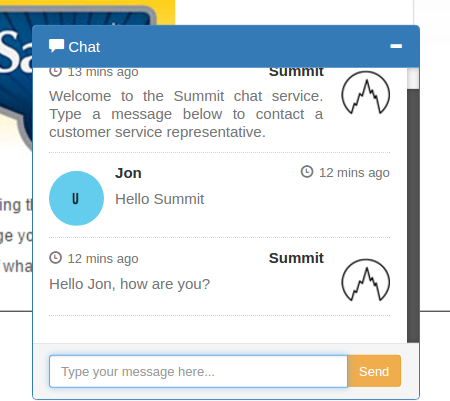

# Sample Chat application using Socket.io, Angular 2, Express.js, and Node.js

## Local installation instructions

- Clone repo
- `npm install`
- `gulp` will start a browersync session
- Open 2 browsers, one to `localhost:4000` and one to `localhost:3000`
- One username must be `Summit` and the other can be anything.

